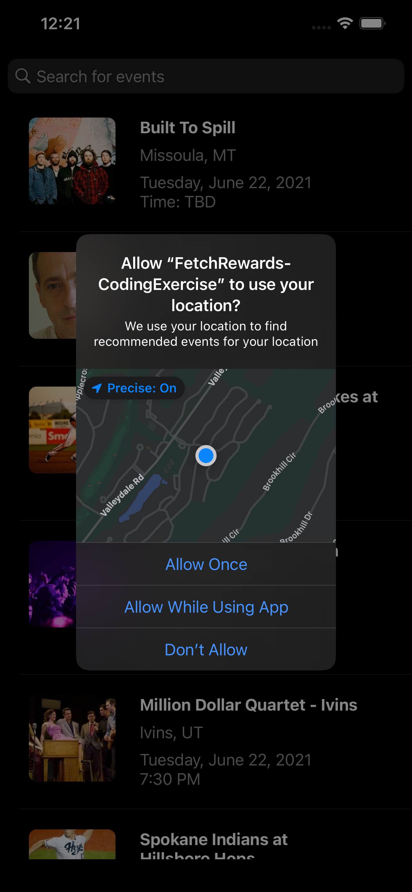

<!--
*** Thanks for checking out the Best-README-Template. If you have a suggestion
*** that would make this better, please fork the repo and create a pull request
*** or simply open an issue with the tag "enhancement".
*** Thanks again! Now go create something AMAZING! :D
***
***
***
*** To avoid retyping too much info. Do a search and replace for the following:
*** caleb-harrison, FetchRewards-Coding-Exercise, twitter_handle, calebpharrison@gmail.com, project_title, project_description
-->


<!-- PROJECT SHIELDS -->
<!--
*** I'm using markdown "reference style" links for readability.
*** Reference links are enclosed in brackets [ ] instead of parentheses ( ).
*** See the bottom of this document for the declaration of the reference variables
*** for contributors-url, forks-url, etc. This is an optional, concise syntax you may use.
*** https://www.markdownguide.org/basic-syntax/#reference-style-links
-->
<h1 align="center">
  <br/>
</h1>

<p align="center">
  <p align="center">
    iOS application that consumes the open-source SeatGeek API<br/>
    and displays events in a UITableView. The application fetches recommended<br/>
    events from the user's location and relevant events based on search.
    <br/><br/>
    <a href="#features"><strong>Features</strong></a>
    ∙
    <a href="#contact"><strong>Contact Information</strong></a>
    ∙
    <a href="#about-the-project"><strong>Explore the documentation »</strong></a>

  </p>
</p>

<p align="center">
    
    <a href="https://swift.org/">
        
    </a>
    <a href="https://github.com/caleb-harrison/FetchRewards-Coding-Exercise/blob/master/LICENSE.txt">
        
    </a>
    <a href="https://linkedin.com/in/calebharrison0">
        
    </a>
</p>

<!-- TABLE OF CONTENTS -->
<details open="open">
  <summary><h2 style="display: inline-block"> Table of Contents</h2></summary>
  <ol>
    <li>
      <a href="#about-the-project">About The Project</a>
      <ul>
        <li><a href="#requirements">Requirements</a></li>
        <li><a href="#features">Features</a></li>
      </ul>
    </li>
    <li>
      <a href="#getting-started">Getting Started</a>
      <ul>
        <li><a href="#installation">Installation</a></li>
      </ul>
    </li>
    <li><a href="#developer-notes">Developer Notes</a></li>
    <li><a href="#contact">Contact</a></li>
    <li><a href="#license">License</a></li>
  </ol>
</details>


## About The Project

This Swift project was assigned as a coding exercise from Fetch Rewards. This submission includes
my flair and personality on top of the standard assignment. My goal was to fulfill all requirements
and add a few extra features without over-complicating and cluttering the app and UI.

If I were to have spent more time on the app, I may have added a feature to search by category
(Sports, Concerts, Festivals, etc.), or possibly prompting the user to create an account to be able to
favorite an event and having the data be saved to cloud storage.

### Requirements
- [x] Consume the open-source SeatGeek API
- [x] Display events in a UITableView
- [x] Use UISearchBar placed at the top of the tableview to search for events
- [x] Fetch relevant events from SeatGeek API while user is typing in the search bar
- [x] Tapping on Event's UITableViewCell should display the corresponding event in a detail screen
- [x] Tapping on the back button should take the user back to the Event's TableView
- [x] User should be able to favorite events from the detail screen by hitting the favorite button
- [x] Favorited events should be displayed on the Event's UITableViewCell
- [x] User should be able to unfavorite events
- [x] A favorited event should remain favorited even when searching or closing the application
- [x] Make sure that the application supports iOS 12 and above
- [x] Application must compile with Xcode 12.x.x

### Features
The app has many cool features outside of the requirements while still remaining simple,
easy to navigate and learn, and fulfilling the code exercise. Below are demos of some of those features.
</br>
#### Location
The app initially requests access to the user's location while using the application.
The location is used along with a favorited event to find recommended events. If the
user denies access, the app will still fetch random events to show the user.

_Note: If you would like to check out recommendation features on the simulator, favorite an
event and check "Simulator" -> "Debug" -> "Location" to change the location to nearby coordinates._



</br>

#### Launch screen animation
Whenever you load into the app, you are presented with a custom UIView animation. The animation
shows the seatgeek logo and zooms in for a seamless transition to the home screen.


</br>

#### Dark Mode
Dark mode is automatically recognized from system settings and changes the entire look of the app.
From the launch animation all the way to the button for buying tickets. 

_Note: If you would like to check out dark/light mode features on the simulator, select
"Simulator" -> "Features" -> "Toggle Appearance" and change to dark/light mode._


</br>

#### Favorite events
Whenever you see an event that you like and want to see more of, you can click the heart
button. This will favorite the event for all screens and it will remain favorited until
you unfavorite that event!


</br>

#### Recommended events
After favoriting an event and allowing the app to use your location, it will fetch the API
and find similar events to the event you favorited. Once allowing location and favoriting an
event, just return to the home screen and it will be populated with events near you that are
similar to what you favorited!

_Note: If you would like to check out recommendation features on the simulator, favorite an
event and check "Simulator" -> "Debug" -> "Location" to change the location to nearby coordinates._


</br>

#### Buy tickets for event
If you see an event that you want to buy a ticket for, you can click the buy ticket button and
it will take you directly that event's ticket purchasing link on SeatGeek. Some events may not
have tickets available for purchase, and that could be something to potentially be added to check
for in the future.


## Getting Started

To get a local copy up and running follow these simple steps.


### Installation

1. Clone the repository
   ```sh
   git clone https://github.com/caleb-harrison/FetchRewards-Coding-Exercise.git
   ```
2. Open the project in Xcode
   ```sh
   open FetchRewards-CodingExercise/FetchRewards-CodingExercise.xcodeproj
   ```
3. **Command (⌘)-R:** Select your desired device simulator and run the application

_**Note: If you would like to check out recommendation features, favorite an event and check "Simulator" -> "Debug" -> "Location" to change the location.**_


## Developer Notes

This coding exercise brought me a lot of joy and I appreciate the challenge! I learned a few things along the way and drilled many skills deeper into my existing skillset.

The API brought me a few challenges that I was able to overcome such as:
- Backwards compatability prior to iOS 13
- Fetching recommended events from API based on user's location and a favorited event
- Fetching images from API

Although these challenges were something I hadn't done before, I was quickly able to break down what I wanted to accomplish, do research, and eventually implement the solution. 

>**This project, among others in the last 6-8 months, has highlighted to me that iOS app development is what I love to do and what best encapsulates my skillset. I have tried many types of software development and explored other computer science options and mobile application development–specifically iOS app development–brings together all of my favorite portions of development. Mobile app development allows me to constantly show my eye for design while also being able to solve real-world problems and see them unfold before my eyes as I progress.**

>**Working for a company such as Fetch Rewards while being able to do what I love would be a dream come true.
I hope that my passion can be conveyed in my work here and potentially further in a future conversation! Thank you so much for taking the time to review my submission.**

>**– Caleb Harrison ❤️**

## Contact

Caleb Harrison - calebpharrison@gmail.com

Project Link: [https://github.com/caleb-harrison/FetchRewards-Coding-Exercise](https://github.com/caleb-harrison/FetchRewards-Coding-Exercise)

LinkedIn: [https://www.linkedin.com/in/calebharrison0/](https://www.linkedin.com/in/calebharrison0/)


## License

Distributed under the MIT License. See `LICENSE.txt` for more information.


<!-- MARKDOWN LINKS & IMAGES -->
<!-- https://www.markdownguide.org/basic-syntax/#reference-style-links -->
<!-- [commits-shield]: https://img.shields.io/github/commit-activity/m/caleb-harrison/FetchRewards-Coding-Exercise?foo=bar&label=Commits&style=for-the-badge -->

[platform-image]: https://img.shields.io/badge/Platform-iOS-blue.svg?style=for-the-badge

[swift-image]: https://img.shields.io/badge/Swift-5.3.2-green.svg?style=for-the-badge
[swift-url]: https://swift.org/

[license-shield]: https://img.shields.io/github/license/caleb-harrison/FetchRewards-Coding-Exercise?color=red&style=for-the-badge
[license-url]: https://github.com/caleb-harrison/FetchRewards-Coding-Exercise/blob/master/LICENSE.txt

[linkedin-shield]: https://img.shields.io/badge/-LinkedIn-black.svg?style=for-the-badge&logo=linkedin&colorB=555
[linkedin-url]: https://linkedin.com/in/calebharrison0